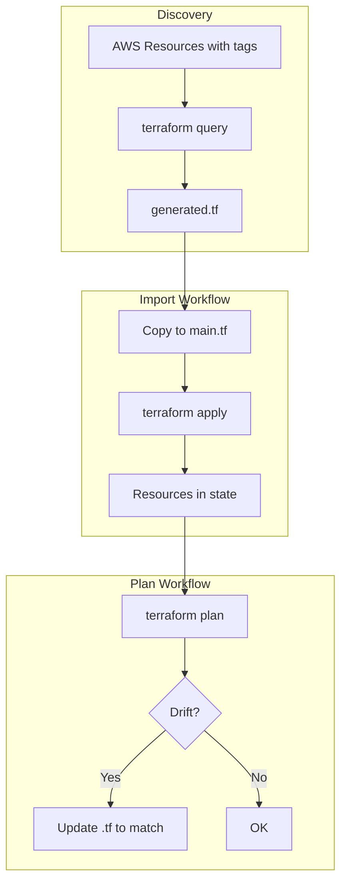

# Plan: Репозиторій terraform-aws-import

## Мета

Новий репозиторій для імпорту існуючих AWS ресурсів у Terraform state з двома основними workflows:

1. **Plan** — перевірка, що конфіг відповідає поточному стану (відстеження drift)
2. **Import** — імпорт ресурсів за критерієм (теги) у state + генерація конфігу

## Архітектура workflow



## Структура репозиторію

```
terraform-aws-import/
├── .github/
│   └── workflows/
│       ├── terraform-plan.yml      # Plan для перевірки drift
│       └── terraform-import.yml     # Import ресурсів за тегами
├── environments/
│   └── dev/
│       ├── main.tf                 # Provider, backend, variables
│       ├── terraform.tfvars
│       └── import.tf               # (опційно) import blocks для ручного імпорту
├── queries/
│   └── discover-by-tags.tfquery.hcl   # Запити для bulk import
├── docs/
│   └── PLAN.md
├── .gitignore
└── README.md
```

## 1. Terraform конфігурація

**Вимоги:**

- Terraform **1.12+** (для `terraform query` і bulk import)
- Terraform **1.5+** (для `import` block + `-generate-config-out`)

**Backend:** S3 + DynamoDB — bucket і table передаються через `-backend-config` у workflow.

**Критерій імпорту:** теги AWS. Наприклад:

- `Project` = назва проєкту
- `ManagedBy` = "terraform" (або відсутній — кандидат на імпорт)
- `Environment` = dev/stg/prd

## 2. Workflow: terraform plan

**Файл:** `.github/workflows/terraform-plan.yml`

**Призначення:** перевірка відповідності конфігу та state. Запускається при PR і manual.

**Кроки:**

1. Checkout, Setup Terraform (1.12+)
2. Configure AWS credentials (GitHub Secrets)
3. `terraform init` з backend-config
4. `terraform fmt -check`, `terraform validate`
5. `terraform plan -no-color`

**Результат:** якщо plan показує зміни — є drift або ресурс ще не описаний в .tf. Потрібно оновити конфіг.

## 3. Workflow: terraform import (bulk)

**Файл:** `.github/workflows/terraform-import.yml`

**Призначення:** пошук ресурсів за тегами, генерація конфігу.

**Кроки:**

1. Checkout, Setup Terraform (1.12+)
2. Configure AWS credentials
3. `terraform init`
4. **Query:** `terraform query -generate-config-out=generated.tf` (з queries/discover-by-tags.tfquery.hcl)
5. Артефакт `generated.tf` — користувач переглядає і мержить вручну

**Важливо:** `terraform query` з `-generate-config-out` створює `generated.tf` з `resource` та `import` blocks. Їх потрібно переглянути і вручну перенести в `main.tf` / окремі файли перед apply.

## 4. Query-файл для bulk import

**Файл:** `queries/discover-by-tags.tfquery.hcl`

Приклад для EC2 instances за тегом `Project`:

```hcl
list "aws_instance" "import_candidates" {
  provider = aws
  limit    = 100
  config {
    filter {
      name   = "tag:Project"
      values = ["my-project"]
    }
    filter {
      name   = "instance-state-name"
      values = ["running"]
    }
  }
}
```

Аналогічно можна додати `list` blocks для інших типів: VPC, security groups, S3, RDS тощо.

## 5. Послідовність роботи (user flow)

1. **Налаштування:** створити S3 bucket + DynamoDB для state, додати secrets у GitHub.
2. **Пошук:** запустити Import workflow → завантажити артефакт `generated.tf`.
3. **Огляд:** переглянути `generated.tf`, прибрати зайве, адаптувати під структуру.
4. **Мерж:** перенести `resource` та `import` blocks у `main.tf` або окремі `*.tf` файли.
5. **Import:** запустити Plan workflow з action `apply` або окремий manual apply для імпорту.
6. **Валідація:** запустити Plan workflow → план має бути порожнім (no changes). Якщо є зміни — оновити конфіг під фактичний стан ресурсів.

## 6. GitHub Secrets / Environment

- `AWS_ACCESS_KEY_ID`
- `AWS_SECRET_ACCESS_KEY`
- Або OIDC (aws-actions/configure-aws-credentials з role-to-assume)

## 7. Обмеження і зауваження

- **terraform query** (bulk) доступний з Terraform 1.12; повноцінний search — з 1.14.
- Не всі AWS ресурси підтримують `list` у tfquery — потрібно перевіряти [документацію провайдера](https://registry.terraform.io/providers/hashicorp/aws/latest).
- Для ресурсів без bulk query: ручні `import` blocks + `terraform plan -generate-config-out=generated.tf`.
- Рекомендація: тегувати ресурси в AWS (Project, Environment) для стабільного фільтру при імпорті.
